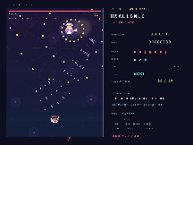

# Touhou: Scarlet Mesa

*Unaligned in San Francisco*

A free, unofficial Touhou Project bullet-hell fan game for Linux and macOS, written in C++17 with SDL2. Fly as Reimu through the Golden Gate fog, a SoMa accelerator, and Yukari's boundary above the bay. The AI safety jokes are fictional spell-card comedy.


**[Download the latest release](https://github.com/NoahWLono/scarlet-mesa/releases/latest)** · **[Controls](docs/CONTROLS.md)** · **[Credits](CREDITS.md)**

Three stages, nine boss spell patterns, and Easy, Normal, and Lunatic difficulties. Practice any stage, graze bullets for score, collect power, and use the shutdown ritual when the bay gets too crowded. Original music and a small focus hitbox accompany a simulation running at 120 Hz.



## Download and play

Choose the archive for your system on the [release page](https://github.com/NoahWLono/scarlet-mesa/releases/latest). Each archive has a SHA-256 checksum file alongside it.

| System | Archive | Launch |
| --- | --- | --- |
| Linux, x86-64 | `scarlet-mesa-<version>-linux-x86_64.tar.gz` | Extract, enter the folder, and run `./scarlet-mesa`. Keep `assets/` beside it. |
| macOS, Apple Silicon or Intel | `scarlet-mesa-<version>-macos-universal.tar.gz` | Extract and open `Scarlet Mesa.app`. |

Linux packages bundle SDL2 and the C++ runtime; they still use your system's desktop and audio libraries. The release workflow builds on Ubuntu 22.04. The universal Mac build includes Apple Silicon and Intel code and targets macOS 11 or later. For another Unix system, use the source build below.

The Mac app is ad-hoc signed and is not notarized by Apple. On first launch, right-click the app and choose **Open**. If macOS blocks it, use **System Settings → Privacy & Security → Open Anyway**, as described in [Apple's instructions](https://support.apple.com/en-us/102445).

## First flight

Use **Up/Down** to select a menu item, **Left/Right** to choose difficulty, then **Enter** to start. Move with **Arrow keys** or **WASD**, shoot with **Z** or **Space**, and hold **Shift** to slow down and show the tiny hitbox at Reimu's center. Press **X** for a bomb, **C** for autofire, and **Esc** to pause.

The [field manual](docs/CONTROLS.md) covers dialogue, practice, continues, and scoring. **M** toggles sound; **F11** toggles fullscreen.

## Build from source

You need a C++17 compiler, CMake 3.20 or newer, and the native development tools for your system. CMake uses an installed SDL2 2.0.18 or newer when available; otherwise it downloads and builds the pinned SDL2 2.32.10 source. That first dependency download needs an internet connection.

```sh
git clone https://github.com/NoahWLono/scarlet-mesa.git
cd scarlet-mesa
cmake -S . -B build -DCMAKE_BUILD_TYPE=Release
cmake --build build -j
ctest --test-dir build --output-on-failure
./build/scarlet-mesa
```

The build copies the included assets beside the executable. Python is only needed to regenerate assets or run additional development tools; playing the game does not require it.

To make a native release archive, build with bundled SDL2:

```sh
cmake -S . -B build-release -DCMAKE_BUILD_TYPE=Release -DSCARLET_BUNDLE_SDL=ON
cmake --build build-release -j
ctest --test-dir build-release --output-on-failure
./scripts/package.sh build-release dist
```

The tests cover the simulation and an application smoke run using SDL's dummy video and audio drivers. The Linux app has also passed the same input and rendering smoke run in a native Wayland window with OpenGL. Input checks inject SDL keyboard events; they do not simulate physical keyboard hardware. See [validation details](docs/VALIDATION.md).

## Local data

The game runs offline. It has no network features, telemetry, accounts, or purchases. Records are saved as `records.txt` in the platform preference directory returned by `SDL_GetPrefPath("ScarletMesa", "ScarletMesa")`.

## Fan work and licenses

Touhou Project and its characters belong to **ZUN / Team Shanghai Alice**. Scarlet Mesa is an unofficial fan work, with no affiliation or endorsement. See the [Touhou Project fan creation guidelines](https://touhou-project.news/guidelines_en/).

The original source code and original music are available under the [MIT license](LICENSE). That license does not grant rights to Touhou characters, setting, or branding. The font atlases use the [SIL Open Font License](assets/FONT-LICENSE.txt). The title illustration was generated for this game; its prompt and provenance are included in [the asset notes](assets/ART-PROVENANCE.txt). [Credits](CREDITS.md) lists each component.
